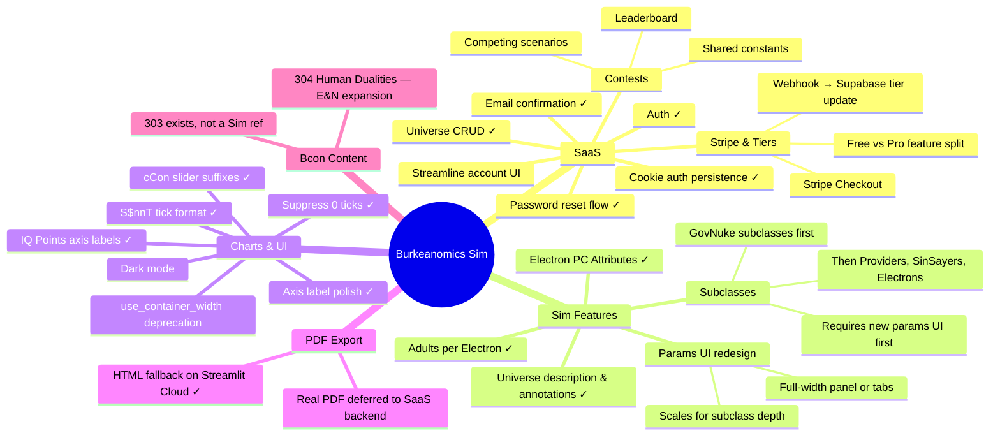

# Burkeanomics Simulator — Roadmap

```mermaid
mindmap
  root((Burkeanomics Sim))
    SaaS
      Auth ✓
      Universe CRUD ✓
      Cookie auth persistence ✓
      Password reset flow ✓
      Email confirmation ✓
      Streamline account UI
      Stripe & Tiers
        Free vs Pro feature split
        Stripe Checkout
        Webhook → Supabase tier update
      Contests
        Shared constants
        Competing scenarios
        Leaderboard
    Sim Features
      Electron PC Attributes ✓
      Adults per Electron ✓
      Universe description & annotations ✓
      Subclasses
        Requires new params UI first
        GovNuke subclasses first
        Then Providers, SinSayers, Electrons
      Params UI redesign
        Full-width panel or tabs
        Scales for subclass depth
    Charts & UI
      Axis label polish ✓
      S$nnT tick format ✓
      IQ Points axis labels ✓
      Suppress 0 ticks ✓
      cCon slider suffixes ✓
      use_container_width deprecation
      Dark mode
    PDF Export
      HTML fallback on Streamlit Cloud ✓
      Real PDF deferred to SaaS backend
    Bcon Content
      304 Human Dualities — E&N expansion
      303 exists, not a Sim ref
```
